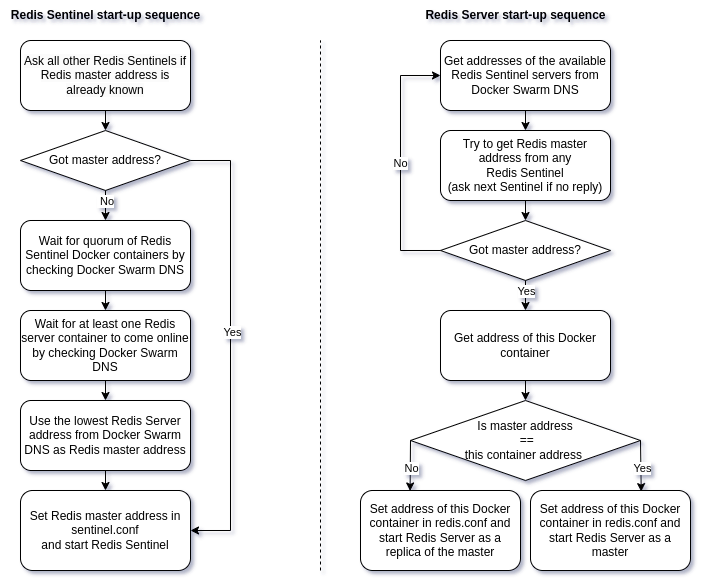

# Ansible role for deployment of a HA Redis Cluster with Sentinel in Docker Swarm

This Ansible role deploys a high-availability Redis Cluster with Sentinel in Docker Swarm nodes using the [official Redis Docker image](https://hub.docker.com/_/redis).
See more on HA Redis Cluster with Sentinel in the [official Redis documentation](https://redis.io/docs/management/sentinel/).  

The tricky bit in making HA Redis Cluster work on Docker Swarm is that Redis requires master server address specified in sentinel configuration file and in replica server command-line parameters, while with Docker Swarm container addresses and hostnames are not known before containers are created. Therefore Redis server and sentinel configuration files cannot be created before Docker Swarm Redis services are deployed. In order to work-around this circumstance, this Ansible role mounts custom Docker entrypoint scripts to server and sentinel containers and instructs Docker to execute these scripts while launching Redis services. The custom entrypoint scripts wait for start-up of a required number of Redis Docker containers, set Redis master server address in sentinel and replica server configs, then execute sentinels and servers. Redis sentinel and server start-up sequences with custom entrypoint scripts are presented in the diagrams below.



Redis clients are supposed to run in Docker Swarm and connect to the HA Redis Cluster via `redis` Docker Swarm overlay network using internal Docker DNS names, ex. `redis-server-1.redis`.
A client connected to the overlay network can discover Redis Cluster hosts via DNS, for example, by using the following shell commands:
```shell
$ getent hosts redis-server
10.16.0.183     redis-server
10.16.0.182     redis-server
10.16.0.181     redis-server
$ getent hosts redis-sentinel
10.16.0.184     redis-sentinel
10.16.0.186     redis-sentinel
10.16.0.185     redis-sentinel
```

The hosts for deployment of HA Redis Cluster server and sentinel instances can be specified by setting `redis_server_hosts` and `redis_sentinel_hosts` list variables in `defaults/main.yml`. If fewer servers or sentinels are required than there are hosts available, set `redis_server_replication_factor` or  `redis_sentinel_replication_factor` in `defaults/main.yml`, otherwise Redis servers will be deployed on all `redis_server_hosts` and Redis sentinels will be deployed on all `redis_sentinel_hosts`.  

Sentinel quorum number must be defined by `redis_quorum` parameter in `defaults/main.yml` depending on the number of sentinel replicas. For example, if you are deploying 3 sentinel replicas, set `redis_quorum` to 2. See more about quorum in [Redis Sentinel documentation](https://redis.io/docs/management/sentinel/).  

Redis data persistence can be enabled or disabled by setting `redis_persistence_enabled` parameter value to `true` or `false` in `defaults/main.yml`. It is beneficial to have persistence enabled in order to improve resilience of the cluster. With data persistence disabled Redis cluster won't be able to survive outage of all of the server instances, and the cluster may become nonfunctional after server instances are restored. Unless you are planning to store large amounts of data, it is advised to have persistence enabled. See more about data persistence in [Redis Persistence documentation](https://redis.io/docs/management/persistence/).  

You may set `redis_password` in `defaults/main.yml` to protect communications between Redis clients, master, replicas and sentinels.  

In order to limit memory usage by Redis server set `redis_maxmemory` to something other than `0` in `defaults/main.yml`.

Prometheus metrics export can be enabled by setting `redis_prometheus_enabled` in `defaults/main.yml` to `true`.

You may set `docker_mtu` to a value lower than the default MTU 1500 if your LAN network is a VXLAN or other sort of a virtual network with a non-standard MTU size.

Example:
```yaml
redis_server_hosts:
  - redis-server-1.example.com
  - redis-server-2.example.com
  - redis-server-3.example.com
  - redis-server-4.example.com
redis_sentinel_hosts:
  - redis-sentinel-1.example.com
  - redis-sentinel-2.example.com
  - redis-sentinel-3.example.com
  - redis-sentinel-4.example.com
redis_server_port: "6379"
redis_sentinel_port: "26379"
redis_exporter_port: "9121"
redis_sentinel_exporter_port: "9355"
redis_maxmemory: "200M"
redis_cluster_name: "mycluster"
redis_server_replication_factor: 3
redis_sentinel_replication_factor: 3
redis_quorum: 2
redis_password: "password"
redis_persistence_enabled: true
redis_prometheus_enabled: true
docker_mtu: 1390
```

Redis server configuration parameters are specified in `templates/redis.conf.j2`. Here is the contents of the file:
```
port {{ redis_server_port }}

replica-announce-ip 0.0.0.0

timeout 0
tcp-keepalive 300


appendonly yes


# Stop accepting writes if a master detects that it is no longer
# able to transfer its writes to the specified number of replicas
min-replicas-to-write 1
min-replicas-max-lag 10
```
Server address `0.0.0.0` is replaced with the actual address of a redis server Docker container by the entrypoint script.


Redis sentinel configuration parameters are specified in `templates/sentinel.conf.j2`. Here is the contents of the file:
```
port {{ redis_sentinel_port }}

sentinel announce-hostnames yes
sentinel resolve-hostnames yes
sentinel announce-ip 0.0.0.0

sentinel monitor {{ redis_cluster_name }} 0.0.0.0 {{ redis_server_port }} {{ redis_quorum }}
sentinel down-after-milliseconds {{ redis_cluster_name }} 5000
sentinel failover-timeout {{ redis_cluster_name }} 60000
sentinel parallel-syncs {{ redis_cluster_name }} 1
```
Master address `0.0.0.0` is replaced with the actual address of the master server Docker container by the entrypoint script.
